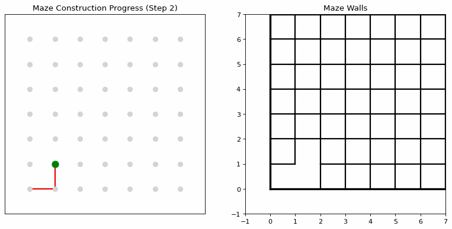
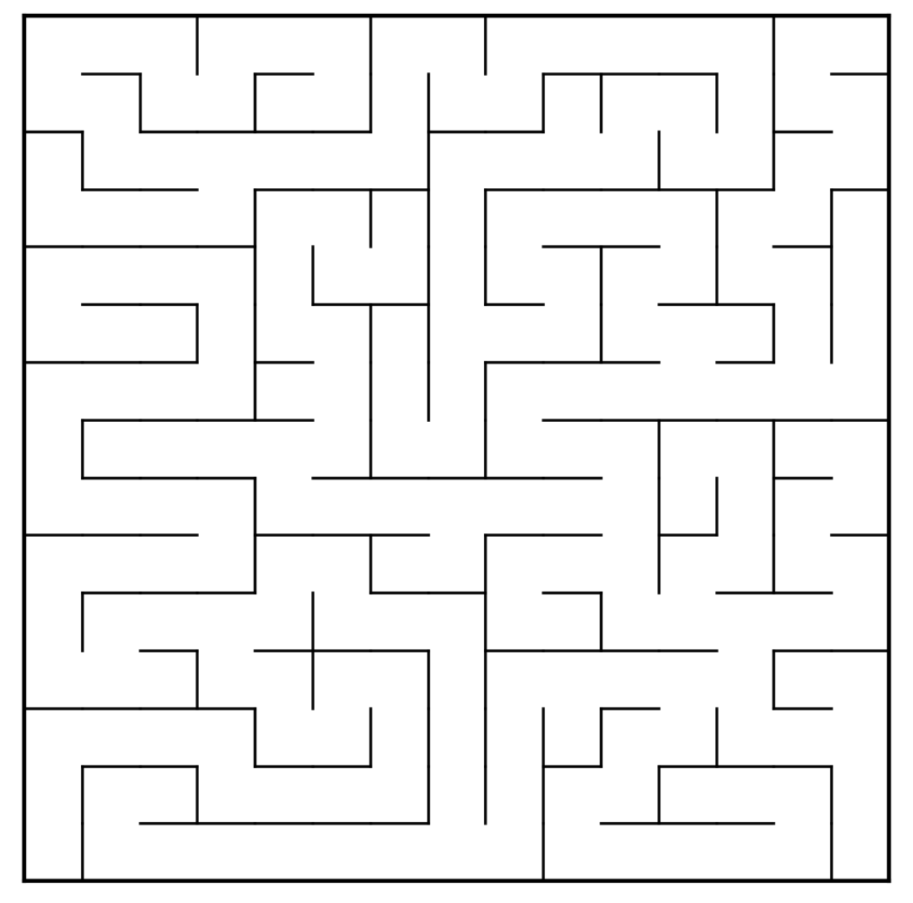
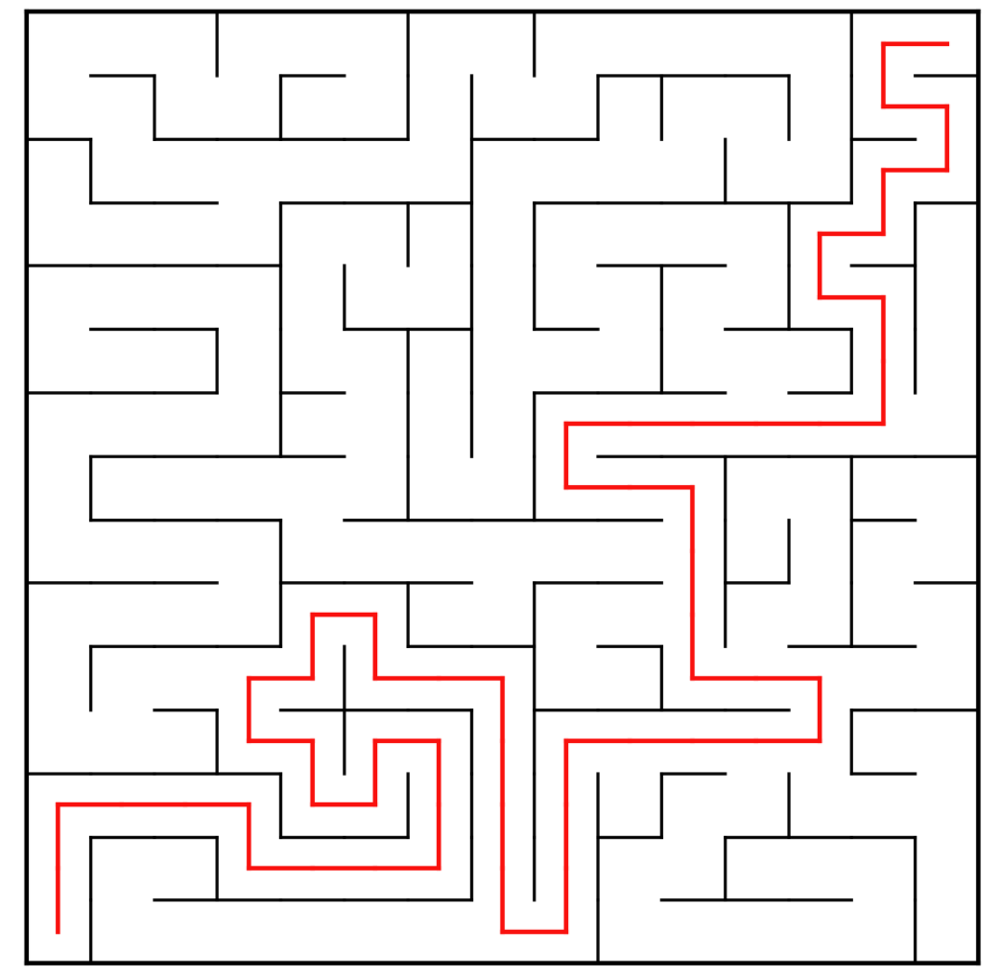
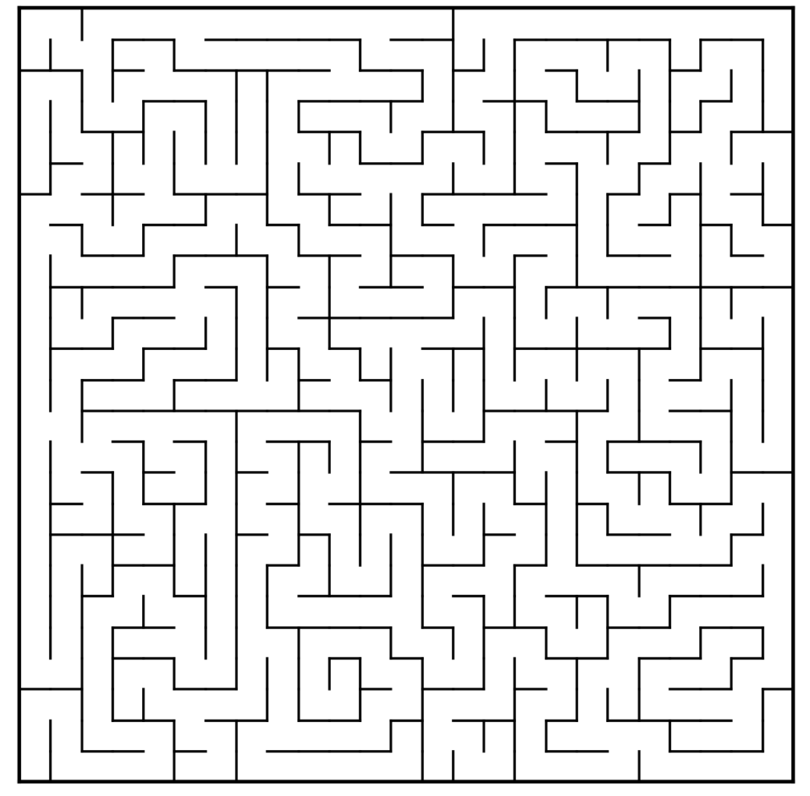
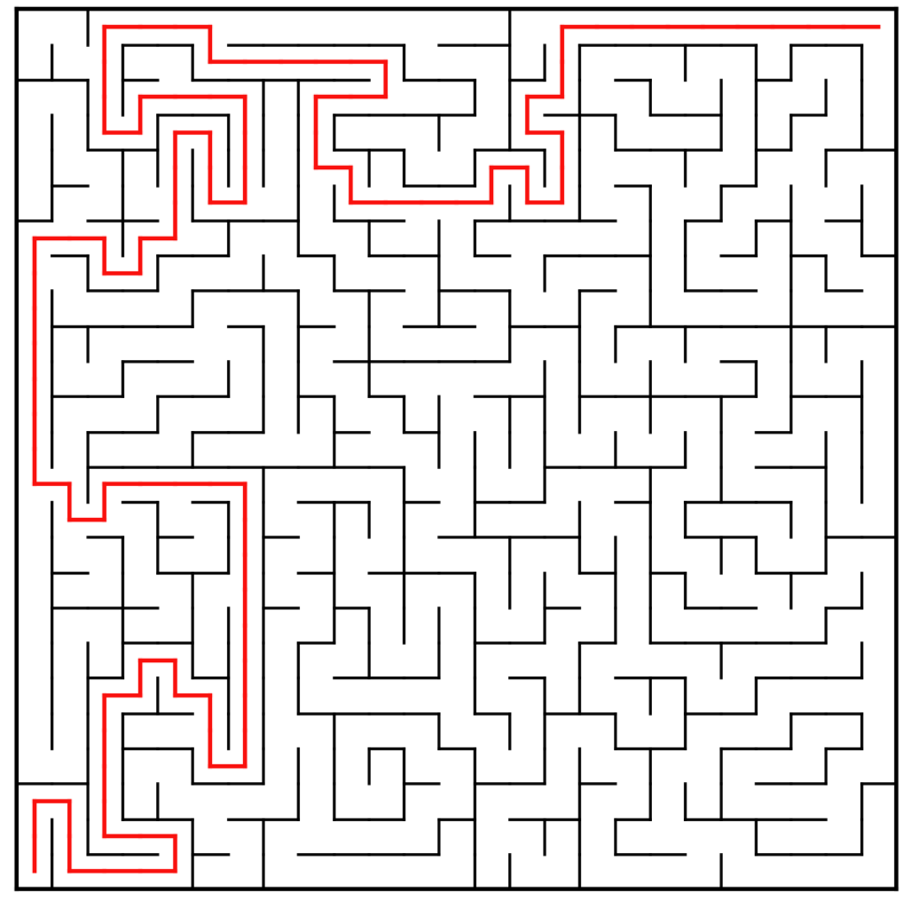
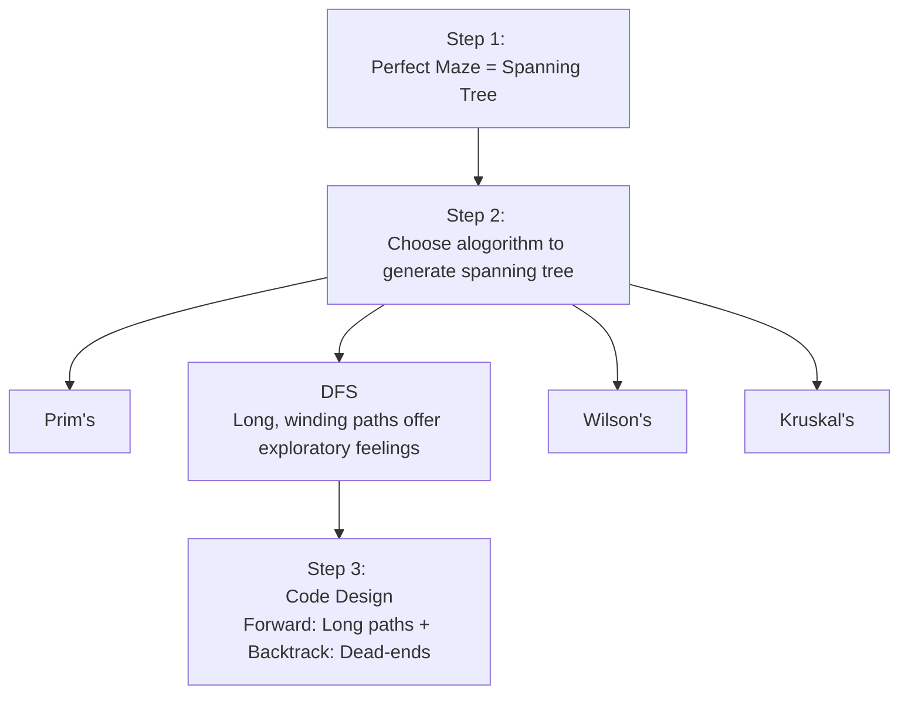

# 🎛️ Random Maze Generator | DFS Application
  

## 🚀 Overview

> **"A maze is essentially a spanning tree of the grid!"** 
> This Python project generates mazes using a Randomized Depth-First Search (DFS) algorithm with backtracking. 

  
- ✅**Perfect Mazes:** Every cell is reachable, with exactly one path between any two points (no cycles).
- ✅**Customizable Size:** Easily generate mazes of different sizes.
- ✅**Visual Output:** The maze is displayed as a clean grid using Python's `matplotlib`.
  
---
  
## 📸 How it looks?

### 1. Maze Construction

  
  
  *Animated random maze construction.*

### 2. Maze Solution

<table width="100%" style="border-collapse: collapse;" align="center">
  <tr>
    <td width="33.33%" align="center" style="padding: 20px; border: 1px solid #e1e4e8; vertical-align: top; width: 300px; height: 350px;">
      <h3 style="font-size: 1.4em; margin: 0 0 20px 0;">15 x 15</h3>
       
      

    </td>
    <td width="33.33%" align="center" style="padding: 20px; border: 1px solid #e1e4e8; vertical-align: top; width: 300px; height: 350px;">
      <h3 style="font-size: 1.4em; margin: 0 0 20px 0;">15 x 15 solution</h3>
       
      

    </td>
  </tr>
  
  <tr>
    <td width="33.33%" align="center" style="padding: 20px; border: 1px solid #e1e4e8; vertical-align: top; width: 300px; height: 350px;">
      <h3 style="font-size: 1.4em; margin: 0 0 20px 0;">25 x 25</h3>
       
      

    </td>
    <td width="33.33%" align="center" style="padding: 20px; border: 1px solid #e1e4e8; vertical-align: top; width: 300px; height: 350px;">
      <h3 style="font-size: 1.4em; margin: 0 0 20px 0;">25 x 25 solution</h3>
       
      

    </td>
  </tr>
</table>

---
  
## 🏗️ How it works?

